# AI Runtime Graph — Banking AI Agent

**Version:** 1.0
**Last Updated:** 2026-05
**Source of truth:** `ARCHITECTURE.md §7`, `STATE_MACHINE.md`, `internal/TEST_PLAN.md §11`

---

## Overview

The LangGraph runtime forms the core of the Banking AI Agent. It is a
deterministic, state-machine-driven orchestrator that:

1. **Routes** each conversational turn to the correct domain node.
2. **Delegates** LLM calls to a provider stack with automatic fallback.
3. **Emits** per-turn telemetry events for AI engineering observability.
4. **Guards** state transitions with `StateGuard` to prevent illegal moves.

The graph runs in a single-threaded, synchronous execution model. All LLM
calls happen inside individual nodes, never in routing/conditional logic.

---

## Runtime Graph — Mermaid Diagram

```mermaid
stateDiagram-v2
    direction TB

    [*] --> start_node : new invoke

    start_node --> triage_node : any session state

    triage_node --> intent_node        : authenticated (non-credential turn)
    triage_node --> registration_node  : CPF not found; user opts to register
    triage_node --> ending_node        : blocked | ended | auth_attempts ≥ 3
    triage_node --> [*]                : awaiting CPF or birth date (END)

    registration_node --> ending_node  : error or ended
    registration_node --> [*]          : collecting data | registration complete (END)

    intent_node --> credit_node           : CREDIT_LIMIT | CREDIT_INCREASE
    intent_node --> credit_interview_node : CREDIT_INTERVIEW
    intent_node --> exchange_node         : EXCHANGE_QUOTE
    intent_node --> ending_node           : END_CONVERSATION | blocked | unknown_count ≥ 3
    intent_node --> intent_node           : UNKNOWN (retry < 3)
    intent_node --> [*]                   : clarification prompt sent (END)

    credit_node --> credit_interview_node : interview offer accepted
    credit_node --> intent_node           : interview declined | credit limit shown
    credit_node --> credit_node           : awaiting interview offer response
    credit_node --> ending_node           : blocked | ended
    credit_node --> [*]                   : user-facing reply sent (END)

    credit_interview_node --> ending_node  : blocked | ended
    credit_interview_node --> [*]          : interview step replied | interview complete (END)

    exchange_node --> intent_node   : quote delivered or recoverable error
    exchange_node --> ending_node   : blocked | ended
    exchange_node --> [*]           : waiting for currency input (END)

    ending_node --> [*]

    note right of intent_node
        LLM touch-point #1
        IntentClassifier.classify_with_telemetry()
        emits: llm_provider_called
        emits: llm_fallback_triggered (if fallback used)
        state fields: provider_used, fallback_triggered, decision_rationale
    end note

    note right of credit_node
        LLM touch-point #2
        StructuredResponseInterpreter.interpret_choice_with_telemetry()
        Used to interpret interview offer acceptance / confirmation
        emits: llm_provider_called
        emits: llm_fallback_triggered (if fallback used)
    end note
```



---

## Node Inventory

| Node | Module | LLM call? | StateGuard (`_guarded_node`) |
| --- | --- | --- | --- |
| `start_node` | `app.graph.nodes` | No | None |
| `triage_node` | `app.graph.nodes` | No | None |
| `registration_node` | `app.graph.nodes` | No | None |
| `intent_node` | `app.graph.nodes` | **Yes** — IntentClassifier | None |
| `credit_node` | `app.graph.nodes` | **Yes** — StructuredResponseInterpreter | **Yes** — requires authenticated, not blocked, not ended |
| `credit_interview_node` | `app.graph.nodes` | No (deterministic step collection) | **Yes** — requires authenticated, not blocked, not ended |
| `exchange_node` | `app.graph.nodes` | No (ExchangeProvider, not LLM) | **Yes** — requires authenticated, not blocked, not ended |
| `ending_node` | `app.graph.nodes` | No | None — always reachable |

---

## LLM Provider Stack

```txt
LLMManager
  │
  ├─ primary:  GrokProvider   (XAI_API_KEY)
  │             model: grok-4-1-fast  (default; overridable via PRIMARY_MODEL)
  │             task label carried in LLMRequest.task
  │
  └─ fallback: OpenAIProvider (OPENAI_API_KEY)
               model: gpt-5.1  (default; overridable via FALLBACK_MODEL)
               only called when primary raises LLMProviderError
```

In tests the stack is replaced with `MockProvider` (deterministic, no
network). The evaluation harness (`scripts/evaluate_intent.py`) uses
`RuleOracleProvider` for CI-safe measurement.

---

## Observability — Telemetry Events

Every LLM attempt (success or failure) emits a structured JSON log line to
the `app.llm.telemetry` logger:

### `llm_provider_called`

Emitted on **every** provider attempt.

```json
{
  "event": "llm_provider_called",
  "task": "intent_classification",
  "provider": "grok",
  "model": "grok-4-1-fast",
  "latency_ms": 182.341,
  "fallback_triggered": "False",
  "success": "True",
  "input_tokens": "41",
  "output_tokens": "4"
}
```

### `llm_fallback_triggered`

Emitted only when **primary fails AND fallback succeeds**.

```json
{
  "event": "llm_fallback_triggered",
  "task": "intent_classification",
  "primary_provider": "grok",
  "primary_model": "grok-4-1-fast",
  "fallback_provider": "openai",
  "fallback_model": "gpt-5.1",
  "latency_ms": 430.12,
  "primary_error_type": "LLMProviderError"
}
```

### GraphState telemetry fields

After `intent_node` runs (when a real LLM call was made), the following
fields are populated in `GraphState`:

| Field | Type | Description |
|-------|------|-------------|
| `provider_used` | `str \| None` | Provider name ("grok", "openai", "mock") |
| `fallback_triggered` | `bool` | True if fallback provider was used |
| `decision_rationale` | `str \| None` | Human-readable summary: `intent_classified=credit_limit confidence=high provider=grok` |

These fields are **internal state only** and are never exposed in API
responses (verified by `test_chat_response_does_not_expose_internal_state`).

---

## IntentClassification Structured Output

`IntentClassifier.classify_with_telemetry()` returns a structured
`IntentClassification` record in addition to the Intent enum value:

```python
IntentClassification(
    intent="credit_limit",
    confidence_bucket="high",   # "high" | "medium" | "low"
    ambiguous=False,
    should_clarify=False,
    safe_rationale="exact_allowed_value"
)
```

### Confidence Bucketing Rules

| Bucket | Condition |
|--------|-----------|
| `high` | LLM returned exact allowed value string |
| `medium` | After case/whitespace normalization the value matched |
| `low` | Output rejected (node name, multi-line, not-in-set) or empty input |

---

## Evaluation Harness

`scripts/evaluate_intent.py` is a standalone CLI that runs the full
intent + confirmation + ambiguity dataset against any provider mode:

```bash
# CI-safe deterministic run (no API keys needed)
python scripts/evaluate_intent.py --mode oracle --compact

# Live Grok/OpenAI run
python scripts/evaluate_intent.py --mode live
```

Dataset: `tests/data/intent_eval_dataset.json`
Sections: intent_classification (20 cases), confirmation_normalization (8 cases), ambiguity_handling (4 cases)

Sample summary (oracle mode):

```json
{
  "summary": {
    "intent_accuracy": 1.0,
    "confirmation_accuracy": 1.0,
    "ambiguity_handling_accuracy": 1.0,
    "overall_fallback_rate": 0.0
  }
}
```

---

## Deferred Work — Phase 3: Subgraphs & Clarification Node

### What was considered

Phase 3 of the AI Engineer maturity plan proposed:

1. **Clarification node** — when `should_clarify=True`, route to a
   `clarification_node` that asks the user a targeted follow-up question
   rather than returning UNKNOWN immediately.
2. **Per-domain subgraphs** — replace the single `StateGraph` in
   `graph_builder.py` with separate `StateGraph` instances per domain
   (credit, exchange) compiled into a parent graph, enabling domain-scoped
   state and independent testing.

### Why it was deferred

| Risk | Detail |
|------|--------|
| **Graph rebuild** | Subgraphs require a substantial rewrite of `graph_builder.py`. The current 589-test suite has deep integration coverage of the graph topology. A structural change of this scope requires a dedicated test session. |
| **State scope complexity** | Per-domain subgraphs introduce nested `GraphState` partitions. Existing tests assert flat state fields directly; migration would require updating test fixtures. |
| **Clarification routing** | The UNKNOWN→clarify→re-classify loop needs careful state management to prevent infinite loops. Requires a max-clarification counter and tests. |

### Recommended next steps

1. Add `clarification_count` field to `GraphState`.
2. Introduce `clarification_node` as a leaf node that returns
   `next_step = "intent_node"` with a targeted prompt.
3. Update `intent_node` to consult `classification.should_clarify` and
   `classification.ambiguous` to decide the routing branch.
4. Rebuild `graph_builder.py` with domain subgraphs only after the
   clarification node has full test coverage.
