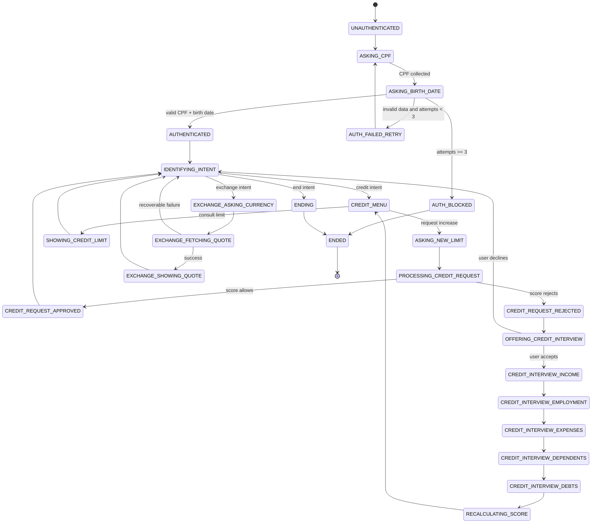

# Banco Ágil - Intelligent Banking Agent

**Status:** Documentation Foundation Completed
**Target:** Technical Challenge / Senior AI Agents Consulting Case
**Primary Goal:** Build a production-oriented simulation of a banking customer service system powered by specialized AI agents, deterministic business rules, observable orchestration, and a web interface suitable for evaluator testing.

---

## 1. Executive Summary

Banco Ágil is a fictional digital bank that requires an intelligent customer service system capable of handling authentication, credit limit inquiries, credit increase requests, credit score interviews, and currency exchange quotation.

The system must behave as a single conversational assistant from the user's perspective, while internally routing requests between specialized agents with strict scopes of responsibility.

This project is not intended to be a generic chatbot. It is an agentic banking workflow engine where:

* Business rules are deterministic.
* Agent transitions are explicit and traceable.
* LLM usage is constrained and validated.
* CSV files remain the official persistence layer required by the challenge.
* The frontend is a thin client with no business logic.
* The backend is responsible for orchestration, validation, state, persistence, and risk control.

The implementation will use LangGraph to model agent orchestration as a state graph, FastAPI as the backend interface, and React with TailwindCSS as the deployable frontend experience.

---

## 2. Product Context

### 2.1 Business Scenario

Banco Ágil wants to simulate customer support through AI agents specialized by domain:

1. Triage Agent
2. Credit Agent
3. Credit Interview Agent
4. Exchange Agent

The customer must not perceive explicit handoffs between agents. The conversation should remain fluid, objective, and respectful.

### 2.2 Evaluation Context

This project is being built as a senior technical challenge aligned with a consulting role involving:

* AI agent implementation from briefing to go-live.
* Technical discovery and requirements documentation.
* Client-facing solution design.
* Risk monitoring and assisted operation.
* API and enterprise integration thinking.
* Practical use of AI agent frameworks such as LangGraph, CrewAI, Agno, or OpenAI Agents SDK.

The chosen architecture must therefore demonstrate more than feature completion. It must demonstrate consulting maturity, engineering discipline, observability, and clear trade-off management.

---

## 3. Architectural Philosophy

This project follows an engineering-first approach inspired by two principles:

### 3.1 Akita-style Engineering Discipline

The system must avoid uncontrolled "vibe coding". The AI model is not the architect, not the authority over business rules, and not the source of truth.

The human-defined architecture controls:

* Domain boundaries.
* Business rules.
* State transitions.
* Data contracts.
* Persistence strategy.
* Test strategy.
* Security constraints.

The LLM may assist with natural language understanding and response generation, but it cannot override deterministic services.

### 3.2 Documentation-First Execution

The project will be built documentation-first, using controlled execution waves inspired by context engineering discipline, but without adopting the GSD software as an operational dependency.

This `PROJECT.md` is the master document and must remain consistent with:

* `REQUIREMENTS.md`
* `ARCHITECTURE.md`
* `STATE_MACHINE.md`
* `DECISIONS.md`
* `internal/TEST_PLAN.md`
* `API_CONTRACT.md`

Implementation must follow atomic execution waves. No large uncontrolled code generation is allowed.

---

## 4. Non-Negotiable Project Principles

1. Architecture first, code later.
2. Business rules must be deterministic and testable.
3. LLMs must never make financial decisions.
4. LangGraph orchestrates workflow, but does not own business logic.
5. CSV is the official challenge persistence layer.
6. All CSV access must be encapsulated behind repositories.
7. React must remain a thin frontend.
8. Every agent must have a strict scope.
9. Transitions between agents must be implicit to the customer but explicit in code.
10. Authentication gates all protected flows.
11. Tests must be written before core implementation.
12. Observability is mandatory for agent transitions and failures.

---

## 5. Scope

### 5.1 In Scope for V1

The V1 must implement:

* Customer authentication using CPF and date of birth.
* Maximum of three failed authentication attempts per session.
* Conversation termination after the third failed authentication attempt.
* Intent identification after successful authentication.
* Credit limit consultation.
* Credit increase request.
* Credit request registration in `solicitacoes_aumento_limite.csv`.
* Credit approval or rejection based on `score_limite.csv`.
* Offer to redirect rejected customers to a credit interview.
* Structured credit interview.
* Credit score recalculation.
* Customer score update in `clientes.csv`.
* Redirection from credit interview back to credit analysis.
* Currency exchange quotation using an external API.
* Graceful handling of invalid input, CSV failures, and external API failures.
* FastAPI backend.
* LangGraph orchestration.
* React + Tailwind frontend.
* Publicly accessible frontend deployment.
* README with setup, architecture, features, decisions, challenges, and testing instructions.

### 5.2 Out of Scope for V1

The following items are intentionally out of scope:

* Real banking integration.
* Real CPF validation against public or private registries.
* Real credit bureau integration.
* Real account login with password, OTP, OAuth, or biometrics.
* Production-grade database migration.
* PostgreSQL persistence.
* Real transactional banking operations.
* User registration.
* Admin dashboard.
* Multi-tenant architecture.
* Full audit dashboard.
* Human handoff to call center operators.
* Payment execution.
* Real customer PII beyond sample data.

### 5.3 Optional Enhancements

Optional enhancements may be implemented only after the V1 is stable:

* Endpoint to download or view generated credit requests.
* LangSmith integration for trace visualization.
* Docker setup.
* CI pipeline with automated tests.
* SQLite or PostgreSQL adapter as production-ready replacement for CSV.
* Rate limiting.
* Frontend deployment preview per pull request.

---

## 6. Technology Stack

### 6.1 Backend

* **Language:** Python 3.11+
* **API Framework:** FastAPI
* **Agent Orchestration:** LangGraph
* **Validation:** Pydantic v2
* **Testing:** pytest
* **HTTP Client:** httpx
* **CSV Handling:** Python standard `csv` module
* **File Locking:** portalocker or equivalent cross-platform file lock
* **Logging:** structured Python logging
* **Environment Management:** python-dotenv or pydantic-settings

### 6.2 Frontend

* **Framework:** React
* **Language:** TypeScript
* **Styling:** TailwindCSS
* **Build Tool:** Vite
* **Deployment:** Vercel

V1 will use Vite + React + TailwindCSS. Next.js is intentionally avoided because SSR and routing complexity are unnecessary for a single-page chat interface.

### 6.3 LLM Provider

Supported providers for V1:

* Grok API as primary provider
* OpenAI API as fallback provider

The LLM provider must be abstracted behind an interface so the system can run with:

* A real LLM provider.
* A deterministic mock provider for tests.
* A fallback keyword-based classifier if the LLM fails.

### 6.4 LLM Configuration Strategy (Primary + Fallback)

The system uses a dual-provider strategy to ensure availability, cost efficiency, and resilience.

Configuration:

```python
OPENAI_URL = "https://api.openai.com/v1/chat/completions"
XAI_URL = "https://api.x.ai/v1/chat/completions"

PRIMARY_MODEL = "grok-4-1-fast"
FALLBACK_MODEL = "gpt-5.1"

XAI_API_KEY = "..."
OPENAI_API_KEY = "..."
EXCHANGE_API_KEY = "..."  # optional, for external FX provider in later phases
```

Rules:

1. The system must always attempt the primary model (Grok) first.
2. If the primary provider fails (timeout, rate limit, invalid response), the system must fallback to OpenAI.
3. Fallback must be transparent to the user.
4. All provider calls must be wrapped in a unified interface (`LLMProvider`).
5. Responses from both providers must pass Pydantic validation before being used.

Observability:

* Logs must indicate:

  * provider used
  * fallback activation
  * latency
  * token usage (when available)

Security:

* API keys must never be exposed to frontend.
* Keys must be loaded via environment variables only.
* The canonical xAI key variable is `XAI_API_KEY` (not `GROK_API_KEY`).

---

## 7. High-Level Architecture

The system follows a layered architecture:

```txt
Frontend React
   ↓
FastAPI HTTP API
   ↓
LangGraph Orchestration Layer
   ↓
Agent Nodes
   ↓
Deterministic Services
   ↓
Repositories
   ↓
CSV Files
```

### 7.1 Layer Responsibilities

#### Frontend

Responsible for:

* Rendering the chat interface.
* Sending user messages to the backend.
* Displaying assistant responses.
* Managing local UI state such as loading and message history.
* Resetting the conversation session.

Not responsible for:

* Authentication logic.
* Credit logic.
* Score logic.
* Agent routing.
* CSV access.
* Business decisions.

#### FastAPI API Layer

Responsible for:

* Receiving chat requests.
* Validating request payloads.
* Creating or resolving session IDs.
* Invoking the LangGraph workflow.
* Returning normalized responses to the frontend.

#### LangGraph Orchestration Layer

Responsible for:

* Managing agent workflow.
* Executing graph nodes.
* Maintaining structured conversation state.
* Routing between triage, credit, interview, exchange, and end states.
* Producing traceable transitions.

Not responsible for:

* Business rule calculation.
* CSV persistence implementation.
* Financial decisions.

#### Agent Nodes

Responsible for:

* Coordinating user-facing interaction for a specific domain.
* Calling deterministic services.
* Requesting intent classification when needed.
* Returning structured `AgentResponse` objects.

#### Services

Responsible for deterministic business behavior:

* Authentication.
* Credit analysis.
* Score calculation.
* Currency exchange lookup.
* Intent fallback classification.
* Session control.

#### Repositories

Responsible for:

* Reading CSV files.
* Writing CSV files.
* Applying file locks for writes.
* Keeping persistence concerns isolated from business logic.

---

## 8. Proposed Repository Structure

The canonical backend and frontend folder structure is defined in `ARCHITECTURE.md`.

For implementation, the CLI must follow `ARCHITECTURE.md` as the source of truth for physical file placement.

Do not infer folder structure from this summary.

Required top-level structure:

```txt
backend/
  app/
    api/
    config/
    core/
    graph/
    agents/
    services/
    repositories/
    llm/
    schemas/
    observability/
    data/
    scripts/
    tests/

frontend/
  src/
```

Detailed file-level structure must be taken from `ARCHITECTURE.md`, not from this summary.

---

## 9. Domain Model

### 9.1 Customer

Represents a known bank customer loaded from `clientes.csv`.

Fields:

* `cpf: str`
* `data_nascimento: str`
* `nome: str`
* `score_atual: int`
* `limite_credito: float`

Rules:

* `cpf` must be treated as string to preserve leading zeros if present.
* `score_atual` must be between 0 and 1000.
* `limite_credito` must be non-negative.

### 9.2 CreditLimitRequest

Represents a formal credit increase request.

Fields:

* `cpf_cliente: str`
* `data_hora_solicitacao: str`
* `limite_atual: float`
* `novo_limite_solicitado: float`
* `status_pedido: Literal['pendente', 'aprovado', 'rejeitado']`

Rules:

* Request must first be created as `pendente` internally.
* After score validation, status becomes `aprovado` or `rejeitado`.
* Final record must be persisted in `solicitacoes_aumento_limite.csv`.

### 9.3 CreditInterviewData

Represents structured information collected during the credit interview.

Fields:

* `renda_mensal: float`
* `tipo_emprego: Literal['formal', 'autonomo', 'desempregado']`
* `despesas_fixas_mensais: float`
* `numero_dependentes: int`
* `tem_dividas_ativas: bool`

Rules:

* `renda_mensal` must be non-negative.
* `despesas_fixas_mensais` must be non-negative.
* `numero_dependentes` must be non-negative.
* Employment type must be normalized before scoring.

### 9.4 GraphState / SessionState

Represents the full conversation state.

Fields:

* `session_id`
* `trace_id`
* `authenticated`
* `auth_attempts`
* `is_blocked`
* `cpf_candidate`
* `birth_date_candidate`
* `authenticated_cpf`
* `current_customer`
* `current_state`
* `previous_state`
* `next_step`
* `ended`
* `intent`
* `unknown_intent_count`
* `last_user_input`
* `last_assistant_output`
* `recent_messages`
* `last_action_summary`
* `system_bridge_message`
* `credit_request`
* `request_rejected`
* `interview_offer_response`
* `interview_data`
* `interview_step`
* `interview_complete`
* `exchange_request`
* `recoverable_error`
* `retry_available`
* `fatal_error`
* `provider_used`
* `fallback_triggered`
* `decision_rationale`
* `last_error`

Rules:

* `GraphState` is the source of truth for runtime routing.
* The canonical implementation shape of this state is defined in `STATE_MACHINE.md`.
* Older names such as `blocked`, `pending_credit_request`, or `credit_interview_data` must not be used.
* Public API states may differ from internal graph states.

### 9.5 AgentResponse

Represents the internal response produced by an agent or node before being converted into the public API `ChatResponse`.

Fields:

* `reply: str`
* `agent: Literal['triage', 'credit', 'credit_interview', 'exchange', 'system']`
* `state: str`
* `state_update: dict`
* `decision_rationale: str | None`
* `recoverable_error: bool`
* `retry_available: bool`
* `fatal_error: bool`

Rules:

* `AgentResponse` is internal.
* It must not expose raw LLM output.
* It must not expose internal LangGraph node names.
* It must be converted by the API layer into `ChatResponse`.

---

## 10. CSV Contracts

### 10.1 `clientes.csv`

Purpose: official customer database for authentication, credit limit consultation, and score update.

Required columns:

```txt
cpf,data_nascimento,nome,score_atual,limite_credito
```

Example:

```csv
cpf,data_nascimento,nome,score_atual,limite_credito
12345678901,1990-05-12,Ana Silva,720,5000.00
98765432100,1985-11-20,Carlos Souza,540,2500.00
```

Rules:

* `data_nascimento` must be stored as `YYYY-MM-DD`.
* User-provided dates must be accepted only as `DD-MM-YYYY` and normalized to `YYYY-MM-DD` before authentication.

### 10.2 `score_limite.csv`

Purpose: maps score ranges to maximum allowed credit limits.

Required columns:

```txt
score_minimo,score_maximo,limite_maximo_permitido
```

Example:

```csv
score_minimo,score_maximo,limite_maximo_permitido
0,299,1000.00
300,499,2500.00
500,699,5000.00
700,849,10000.00
850,1000,20000.00
```

### 10.3 `solicitacoes_aumento_limite.csv`

Purpose: stores formal credit increase requests.

Required columns:

```txt
cpf_cliente,data_hora_solicitacao,limite_atual,novo_limite_solicitado,status_pedido
```

Rules:

* Must be append-only in V1.
* Writes must be protected with a file lock.
* Timestamp must use ISO 8601.

---

## 11. Agent Scope

### 11.1 Triage Agent

Objective:

Authenticate the customer and route the request after successful authentication.

Allowed responsibilities:

* Greet the user.
* Ask for CPF.
* Ask for date of birth.
* Validate authentication using `AuthService`.
* Track failed authentication attempts.
* End the conversation after three failed attempts.
* Forward authenticated users to intent detection.

Forbidden responsibilities:

* Consult credit limit.
* Approve credit requests.
* Recalculate score.
* Query exchange rates.
* Bypass authentication.

### 11.2 Credit Agent

Objective:

Handle credit limit consultation and credit increase requests.

Allowed responsibilities:

* Show current credit limit.
* Ask for desired new credit limit.
* Call `CreditService` to evaluate the request.
* Trigger formal request registration through deterministic backend services.
* Inform approval or rejection.
* Offer credit interview when rejected.

Forbidden responsibilities:

* Authenticate users.
* Change score directly.
* Query exchange rates.
* Approve credit outside `score_limite.csv`.

### 11.3 Credit Interview Agent

Objective:

Conduct a structured financial interview and recalculate the customer score.

Allowed responsibilities:

* Ask about monthly income.
* Ask about employment type.
* Ask about fixed monthly expenses.
* Ask about dependents.
* Ask about active debts.
* Call `ScoreService`.
* Trigger customer score update through deterministic backend services.
* Redirect back to credit analysis.

Forbidden responsibilities:

* Authenticate users.
* Approve credit directly.
* Query exchange rates.
* Modify credit limit directly.

### 11.4 Exchange Agent

Objective:

Provide current currency quotation.

Allowed responsibilities:

* Identify requested currency.
* Query external exchange API through `ExchangeService`.
* Present the quotation.
* End or return to intent state after completing the exchange request.

Forbidden responsibilities:

* Authenticate users.
* Handle credit operations.
* Update customer data.
* Access CSV files directly.

---

## 12. LangGraph State Machine

### 12.1 Conversation States

```txt
START
UNAUTHENTICATED
ASKING_CPF
ASKING_BIRTH_DATE
AUTH_FAILED_RETRY
AUTH_BLOCKED
AUTHENTICATED
IDENTIFYING_INTENT
CREDIT_MENU
SHOWING_CREDIT_LIMIT
ASKING_NEW_LIMIT
PROCESSING_CREDIT_REQUEST
CREDIT_REQUEST_APPROVED
CREDIT_REQUEST_REJECTED
OFFERING_CREDIT_INTERVIEW
CREDIT_INTERVIEW_INCOME
CREDIT_INTERVIEW_EMPLOYMENT
CREDIT_INTERVIEW_EXPENSES
CREDIT_INTERVIEW_DEPENDENTS
CREDIT_INTERVIEW_DEBTS
RECALCULATING_SCORE
EXCHANGE_ASKING_CURRENCY
EXCHANGE_FETCHING_QUOTE
EXCHANGE_SHOWING_QUOTE
ENDING
ENDED
```

### 12.2 Mermaid Diagram



---

## 13. Business Rules

### 13.1 Authentication Rules

1. Authentication requires CPF and date of birth.
2. CPF and date of birth must match a record in `clientes.csv`.
3. Authentication must happen before access to credit, interview, or exchange flows.
4. The system allows a maximum of three failed attempts.
5. After the third failed attempt, the session becomes blocked and ended.
6. A blocked session cannot be resumed.
7. The frontend may request a new session, but the old session remains blocked.

### 13.2 Credit Limit Rules

1. Only authenticated customers can consult credit limit.
2. Current limit is read from `clientes.csv`.
3. New credit limit request must contain a positive numeric or normalizable monetary value.
4. Requested limit must be compared against the maximum limit allowed by the customer's current score.
5. Score-to-limit mapping comes from `score_limite.csv`.
6. If requested limit is within allowed maximum, the request is approved.
7. If requested limit exceeds allowed maximum, the request is rejected.
8. Every credit increase request must be recorded in `solicitacoes_aumento_limite.csv`.
9. The request status must be one of: `pendente`, `aprovado`, `rejeitado`.

### 13.3 Credit Interview Rules

1. Only authenticated customers can enter the credit interview.
2. The interview collects:

   * Monthly income.
   * Employment type.
   * Fixed monthly expenses.
   * Number of dependents.
   * Active debts.
3. The score must be calculated deterministically.
4. The final score must be clipped between 0 and 1000.
5. The updated score must be persisted in `clientes.csv`.
6. After score update, the user is routed back to credit flow.

### 13.4 Score Formula

```txt
score = ((renda_mensal / (despesas_fixas_mensais + 1)) * 30)
        + peso_emprego[tipo_emprego]
        + peso_dependentes[num_dependentes]
        + peso_dividas[tem_dividas]
```

Weights:

```txt
peso_emprego:
  formal: 300
  autonomo: 200
  desempregado: 0

peso_dependentes:
  0: 100
  1: 80
  2: 60
  3+: 30

peso_dividas:
  sim: -100
  nao: 100
```

Sanitization:

* Negative income is invalid.
* Negative expenses are invalid.
* Negative dependents are invalid.
* Unknown employment type is invalid.
* Values above 1,000,000 must be rejected as invalid input.
* Non-normalizable inputs must be rejected before reaching the calculation layer.
* The system must not attempt to "fix" invalid values silently.
* Invalid inputs must trigger a controlled response asking the user to re-enter valid data.
* Final score must be rounded to integer.
* Final score must be clipped between 0 and 1000.

### 13.5 Exchange Rules

1. Only authenticated customers can request exchange quotation.
2. The system must support USD by default.
3. Other currencies may be supported if the provider allows.
4. API failures must not crash the conversation.
5. If the exchange API is unavailable, the user must receive a clear fallback message.

### 13.6 End Conversation Rule

At any point, if the user indicates they want to end the conversation, the system must transition to `ENDING` and then `ENDED`.

---

## 14. LLM Usage Policy

### 14.1 Allowed LLM Responsibilities

The LLM may be used for:

* Intent classification.
* Natural language response formatting.
* Normalizing user phrases like "quero aumentar meu limite" into a known intent.
* Extracting simple structured values from text, when validated afterward.

### 14.2 Forbidden LLM Responsibilities

The LLM must not:

* Authenticate customers.
* Decide whether credit is approved.
* Calculate scores.
* Update CSV files.
* Decide final financial status.
* Override deterministic services.
* Generate unvalidated data models.
* Access environment variables or secrets.

### 14.3 Fallback Policy

If the LLM provider fails:

1. The system must use a deterministic keyword classifier when possible.
2. If classification remains ambiguous, the system must ask a clarification question.
3. The system must not crash.

---

## 15. API Contract Summary

### 15.1 Health Check

```txt
GET /api/v1/health
```

Response:

```json
{
  "status": "ok"
}
```

### 15.2 Chat

```txt
POST /api/v1/chat
```

Request:

```json
{
  "session_id": "optional-string",
  "message": "quero consultar meu limite"
}
```

Response:

```json
{
  "session_id": "generated-or-existing-session-id",
  "reply": "Claro. Antes disso, preciso confirmar seu CPF.",
  "agent": "triage",
  "state": "ASKING_CPF",
  "ended": false,
  "trace_id": "trace-id"
}
```

### 15.3 Reset Session

```txt
POST /api/v1/sessions/reset
```

Request:

```json
{
  "session_id": "string"
}
```

Response:

```json
{
  "message": "Session reset successfully",
  "session_id": "new-session-id",
  "state": "STARTED",
  "ended": false,
  "trace_id": "trace-id"
}
```

---

## 16. Observability

Observability is mandatory because the target role requires risk monitoring and assisted operation.

### 16.1 Structured Logs

Every graph transition must emit a structured log:

```json
{
  "level": "INFO",
  "trace_id": "uuid",
  "session_id": "uuid",
  "from_state": "ASKING_BIRTH_DATE",
  "to_state": "AUTHENTICATED",
  "agent": "triage",
  "intent": "credit_limit",
  "provider": "grok | openai | fallback",
  "latency_ms": 120,
  "input_tokens": 45,
  "output_tokens": 60,
  "decision_rationale": "Authentication successful based on CPF and birth date match",
  "event": "state_transition"
}
```

### 16.2 Error Logs

Recoverable errors must be logged:

```json
{
  "level": "ERROR",
  "trace_id": "uuid",
  "session_id": "uuid",
  "component": "ExchangeService",
  "provider": "grok | openai",
  "error_type": "ExternalApiUnavailable",
  "fallback_triggered": true,
  "latency_ms": 300,
  "event": "exchange_quote_failed"
}
```

### 16.3 Optional LangSmith

LangSmith may be added as optional observability if time allows. It must not be required for local execution.

---

## 17. Security and Risk Controls

### 17.1 Authentication Gate

No protected flow can run unless `GraphState.authenticated == true`.

Protected flows:

* Credit consultation.
* Credit increase request.
* Credit interview.
* Exchange quotation.

### 17.2 Prompt Injection Resistance

User instructions must not override:

* System scope.
* Business rules.
* Authentication gate.
* Credit approval rules.
* CSV write rules.

### 17.3 Output Validation

Any LLM-generated structured output must be validated with Pydantic before being used.

### 17.4 File Write Safety

CSV writes must:

* Use file locks.
* Preserve headers.
* Avoid partial writes where possible.
* Fail gracefully.

### 17.5 Secret Management

Secrets must be loaded from environment variables.

Forbidden:

* Hardcoded API keys.
* Committing `.env`.
* Exposing provider keys to frontend.

### 17.6 Output Guard (Agent Safety Layer)

The system must validate all agent outputs before applying state transitions.

Rules:

* No transition can occur if it violates GraphState constraints.
* If an invalid transition is suggested (e.g., accessing credit without authentication), the system must:
  1. Reject the transition
  2. Log the violation
  3. Redirect to the appropriate safe state (typically Triage)

This acts as a deterministic guardrail against LLM hallucination or prompt injection.

---

## 18. Testing Strategy

### 18.1 Testing Principle

Core deterministic behavior must be tested before API, LangGraph, LLM, or UI integration.

### 18.2 Unit Tests

Required unit tests:

* `AuthService` authenticates valid customer.
* `AuthService` rejects invalid CPF.
* `AuthService` rejects invalid birth date.
* Authentication blocks after three failed attempts.
* `ScoreService` calculates valid score.
* `ScoreService` clips score to 0-1000.
* `ScoreService` rejects invalid negative values.
* `CreditService` approves valid request.
* `CreditService` rejects request above allowed limit.
* Credit requests are persisted with correct columns.
* Customer score is updated correctly.
* CSV repositories preserve headers.
* CSV repositories handle missing files gracefully.

### 18.3 Integration Tests

Required integration tests:

* Full authentication happy path.
* Full authentication failure path.
* Credit limit consultation after authentication.
* Credit increase approval flow.
* Credit increase rejection flow.
* Rejection followed by credit interview.
* Score update followed by new credit analysis.
* Exchange quotation success.
* Exchange quotation failure fallback.
* End conversation from any state.

### 18.4 LLM Tests

LLM behavior must be tested with deterministic mocks.

No test suite should depend on a live LLM provider.

---

## 19. Execution Plan

### Wave 0 - Documentation Foundation

Deliverables:

* `PROJECT.md`
* `REQUIREMENTS.md`
* `ARCHITECTURE.md`
* `STATE_MACHINE.md`
* `DECISIONS.md`
* `internal/TEST_PLAN.md`
* `API_CONTRACT.md`

No application code in this wave.

### Wave 1 - Project Skeleton

Deliverables:

* Backend folder structure.
* Frontend folder structure.
* Environment examples.
* Test configuration.
* Initial sample CSV files.

No business logic yet.

### Wave 2 - Domain and Schemas

Deliverables:

* Pydantic models.
* Enums.
* Domain types.
* Validation rules.

### Wave 3 - TDD Core

Deliverables:

* Unit tests for auth, score, credit, and repositories.
* Deterministic service implementation.
* Passing test suite.

### Wave 4 - LangGraph Orchestration

Deliverables:

* Graph state.
* Graph nodes.
* Conditional edges.
* Mocked LLM intent classification.
* Integration tests for graph flow.

### Wave 5 - FastAPI Integration

Deliverables:

* `GET /api/v1/health`
* `POST /api/v1/chat`
* `POST /api/v1/sessions/reset`
* API contract validation.
* API integration tests.

### Wave 6 - LLM Provider Integration

Deliverables:

* LLM provider interface.
* Grok/OpenAI implementation.
* Deterministic fallback classifier.
* Pydantic validation for structured outputs.

### Wave 7 - React Frontend

Deliverables:

* Chat interface.
* API client.
* Session handling.
* Reset conversation.
* Loading and error states.

### Wave 8 - Deploy and README

Deliverables:

* Frontend deployment.
* Backend deployment.
* README with architecture and test instructions.
* Known limitations.
* Demo link.

---

## 20. Key Technical Decisions

### 20.1 Why LangGraph?

LangGraph is used because the problem is stateful, cyclic, and agent-oriented.

The system requires:

* Controlled transitions between specialized agents.
* Return from credit interview back to credit analysis.
* Explicit graph state.
* Traceable execution.
* Separation between orchestration and business rules.

LangGraph aligns with the target role requirement for agent frameworks while avoiding uncontrolled autonomous agent behavior.

### 20.2 Why Not CrewAI?

CrewAI is more suitable for collaborative task delegation between agents. This challenge is closer to a deterministic customer service workflow with strict authentication and banking rules.

The agents do not need to debate or collaborate asynchronously. They need to execute controlled state transitions.

### 20.3 Why React Instead of Streamlit?

Streamlit is acceptable for quick local demos, but React offers:

* Lower friction for evaluator testing through web deployment.
* Cleaner separation between frontend and backend.
* A more production-oriented architecture.
* Better alignment with real client-facing delivery.

React is used only as a thin interface, not as a business logic layer.

### 20.4 Why CSV Instead of Database?

CSV is required by the challenge. The architecture uses repositories so CSV can later be replaced by SQLite or PostgreSQL without changing agents or services.

For V1, CSV remains the official persistence layer.

### 20.5 Why Deterministic Services?

Banking workflows require predictable behavior. LLMs are useful for language, but not for financial decisions.

Therefore:

* Auth is deterministic.
* Score is deterministic.
* Credit approval is deterministic.
* CSV persistence is deterministic.
* LLM output is validated and constrained.

---

## 21. Known Limitations

1. CSV is not suitable for high-concurrency production workloads.
2. Free-tier deployments may use ephemeral filesystem storage, causing CSV data loss between restarts.
   * This is acceptable for demo purposes.
   * A seed script (`seed_data.py`) must be provided to restore initial data state.
3. Sample customer data is fictional.
4. Currency API availability depends on provider stability.
5. The credit scoring formula is simplified for challenge purposes.
6. The system does not implement real identity verification.
7. The system does not implement durable distributed session storage in V1.

These limitations must be documented clearly in the README.

## 21.1 Data Reset Strategy

To ensure consistent evaluator experience:

* A script `seed_data.py` must reset all CSV files to a known initial state.
* This script must be runnable locally and optionally on deploy.
* The system must remain functional even after CSV reset.

This guarantees that every evaluator interacts with a predictable dataset.

---

## 22. Production Evolution Path

If this project evolved beyond the challenge, the recommended path would be:

1. Replace CSV repositories with PostgreSQL repositories.
2. Add Redis for session storage.
3. Add durable queue for asynchronous tasks.
4. Add proper audit table for credit decisions.
5. Add real authentication provider.
6. Add observability stack with OpenTelemetry.
7. Add LangSmith or equivalent for agent traces.
8. Add CI/CD with lint, test, and deploy gates.
9. Add human handoff and operator dashboard.
10. Add rate limiting and abuse prevention.

---

## 23. Definition of Done

The project is considered complete when:

1. The user can access a public frontend URL.
2. The user can complete authentication.
3. The user can consult credit limit.
4. The user can request credit increase.
5. The system records credit requests in CSV.
6. The system approves or rejects based on score rules.
7. The user can complete a credit interview after rejection.
8. The system recalculates and persists the new score.
9. The user can request exchange quotation.
10. The system handles API failures gracefully.
11. The backend exposes a documented API.
12. Tests cover deterministic core behavior.
13. LangGraph orchestration is explicit and traceable.
14. README explains architecture, decisions, execution, tests, and known limitations.
15. No API keys or secrets are committed.

---

## 24. Final Architecture Position

The final architecture is:

```txt
FastAPI + LangGraph + Pydantic + pytest
React + TypeScript + TailwindCSS
CSV repositories with file locks
LLM constrained behind validated interfaces
Structured logs for observability
Documentation-first execution through controlled implementation waves
```

The central design principle is simple:

> LangGraph orchestrates the conversation. Deterministic services own the business. The LLM improves language, but never owns decisions.

## 25. RAG Strategy

RAG is not implemented in V1 because the challenge data is structured and deterministic.

The current system uses:

* CSV repositories for customer and credit data.
* Deterministic services for authentication, score calculation, and credit approval.
* LangGraph state control for safe agent routing.

RAG would become relevant in a production banking environment where agents need to answer based on unstructured or semi-structured documents, such as:

* credit policies;
* product manuals;
* compliance documents;
* internal FAQ;
* operational playbooks;
* customer support knowledge base.

In that scenario, the architecture would add a retrieval layer before LLM response generation:

```txt
User Message
  ↓
Intent Detection
  ↓
Policy Retrieval Layer
  ↓
Relevant Documents / Chunks
  ↓
LLM Response Generation
  ↓
Pydantic Validation
  ↓
State Guard
```

Rules:

1. Retrieved context must be cited internally in logs.
2. The LLM must answer only from retrieved context for policy-based questions.
3. Retrieval must never override deterministic services.
4. Credit approval, authentication, and score calculation must remain service-owned.
5. If no reliable context is retrieved, the agent must ask clarification or escalate instead of inventing an answer.

Possible future stack:

* Vector database: ChromaDB, Qdrant, Supabase Vector, or pgvector.
* Embeddings: provider to be decided only if RAG becomes part of a future version.
* Document pipeline: chunking, metadata tagging, versioning, and source traceability.

---

## 26. MCP Strategy

MCP is not implemented in V1 because the challenge integrations are simple and can be safely handled through explicit backend services.

The V1 uses direct service interfaces:

```txt
Agent Node
  ↓
Service
  ↓
Repository / External API
```

This is intentional. It keeps the system easy to test, inspect, and reason about.

MCP would become relevant in a production consulting context where agents need standardized access to multiple external tools, such as:

* CRM systems;
* ERP systems;
* ticketing platforms;
* document repositories;
* banking APIs;
* observability platforms.

In a future version, MCP servers could expose controlled tools such as:

* `get_customer_profile`
* `create_credit_request`
* `fetch_credit_policy`
* `open_support_ticket`
* `query_exchange_rate`
* `write_audit_event`

Rules:

1. MCP tools must be permission-scoped.
2. Agents must never call tools directly without backend validation.
3. Tool outputs must be validated with Pydantic.
4. Tool calls must be logged with trace IDs.
5. Sensitive tools must require authenticated session state.
6. MCP must not replace deterministic business services.

Target future architecture:

```txt
LangGraph Node
  ↓
Tool Access Layer
  ↓
MCP Client
  ↓
MCP Server
  ↓
Enterprise System
```

For V1, explicit services are preferred because they are simpler, safer, and easier to test.

---

## 27. Anti-Hallucination Strategy

The system reduces hallucination risk through architecture, not prompt hope.

Controls:

1. Deterministic business services own all financial decisions.
2. LangGraph controls state transitions explicitly.
3. Pydantic validates all structured outputs.
4. LLM providers are abstracted and replaceable.
5. Fallback classifiers handle basic intents when LLM providers fail.
6. State Guard blocks invalid transitions.
7. CSV repositories are the source of truth for customer and credit data.
8. RAG may be added only for policy/document-based answers.
9. MCP may be added only for controlled enterprise tool access.
10. If the system cannot determine a safe answer, it must ask a clarification question instead of inventing one.

Forbidden behavior:

* inventing customer data;
* inventing credit rules;
* approving credit without `CreditService`;
* bypassing authentication;
* fabricating exchange rates;
* pretending an external tool succeeded when it failed.
